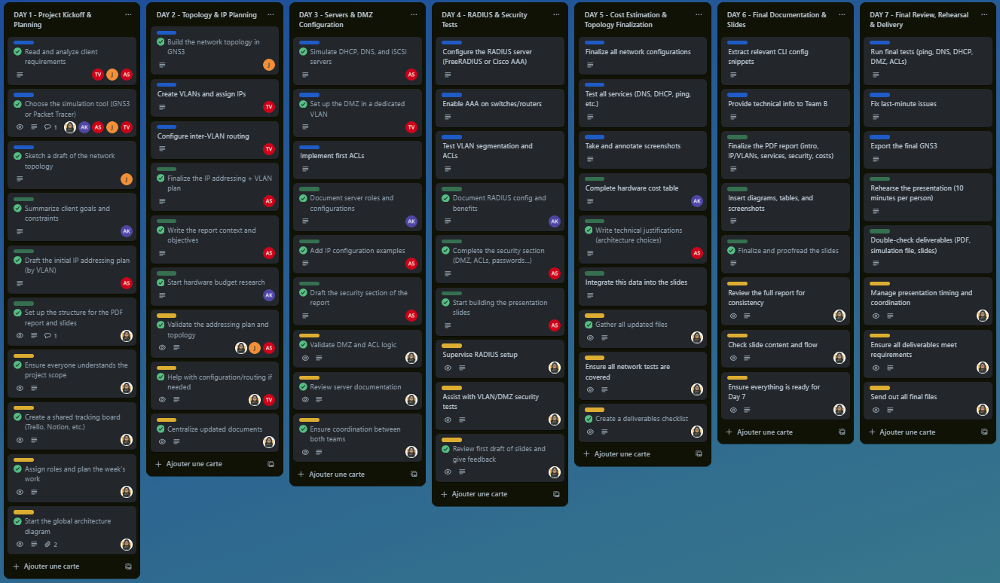

<p align="center">
  
</p>

# 🛡️ Secure Network Design / Conception d’un réseau sécurisé

Projet réalisé dans le cadre d’un challenge réseau de 7 jours, visant à concevoir, simuler et documenter une architecture réseau sécurisée pour une PME en déménagement.

> 💡 Ce projet a été entièrement simulé avec **Cisco Packet Tracer**. 

Project carried out during a 7-day network challenge to design, simulate, and document a secure network architecture for a small business relocating its IT infrastructure.

> 💡 This project was fully simulated with **Cisco Packet Tracer**.

📄 [Challenge](https://github.com/ecomdesignbe/secure-network-design/blob/main/Establish_A_Network_Plan.md)


---

## 🧠 Objectifs / Objectives

**FR**
- Concevoir une topologie réseau sécurisée (VLAN, DMZ, ACL, RADIUS, iSCSI…)
- Simuler l’architecture réseau avec **Packet Tracer**
- Configurer des services réseau : DHCP, DNS, RADIUS, iSCSI
- Documenter l’infrastructure et rédiger une présentation client claire
- Évaluer les coûts matériels

**EN**
- Design a secure network topology (VLAN, DMZ, ACL, RADIUS, iSCSI…)
- Simulate the network using **Packet Tracer**
- Configure core services: DHCP, DNS, RADIUS, iSCSI
- Document the infrastructure and create a client-ready presentation
- Provide an estimate for hardware costs

---

## 🗂️ Structure du dépôt / Repository Structure
```
secure-network-design/
│
├── documentation/                 # Rapport technique & budget || Technical report & budget
│   ├── goals_and_constraints.md   # Cahier des charges || Client needs
│   ├── network_plan.md            # Topologie et plan IP || Network plan
│   ├── server_configurations.md   # Config serveurs (DNS, DHCP, RADIUS...) || Server setups
│   ├── security_policy.md         # Politique de sécurité || Security policy
│   └── budget_estimate.md         # Estimation budgétaire || Budget estimate
│   
│
├── simulation/                    # Fichiers Packet Tracer || Packet Tracer files
│   ├── final_project.pkt          # Simulation complète || Full simulation
│   ├── topology_diagram.png       # Schéma réseau || Network diagram
│   └── captures/                  # Captures écran || Screenshots
│       └── DHCP                   # Captures écran || Screenshots DHCP
│       └── DNS                    # Captures écran || Screenshots DNS
│       └── ISCSI                  # Captures écran || Screenshots ISCSI
│       └── RADIUS SERVER          # Captures écran || Screenshots RADIUS SERVER  
│
├── slides/                        # Présentation finale || Final presentation
│   └── Network Project Slides.pdf # Version PDF || PDF version
│
├── config_samples/                # Extraits de configuration CLI || CLI config snippets
│   ├── dhcp_config.txt            # Configuration DHCP
│   ├── dns_config.txt             # Configuration DNS
│   ├── isci_config.txt            # Configuration ISCI
│   ├── iscsi_client_config.txt    # Configuration ISCI CLIENT
│   └── radius_config.txt          # Configuration RADIUS
│
├── .gitignore                     # Fichiers à exclure du dépôt Git
├── README.md                      # Ce fichier || This file
├── LICENSE                        # Type de licence du projet
└── CHANGELOG.md                   # Journal des modifications || Changelog
```

## 👥 Équipe / Team

- **👤 Chef d’équipe – Steve**  
  Chargé de la création du Trello, de la gestion des deadlines, de la supervision des livrables finaux et du soutien aux deux équipes.  
  **Team Leader – Steve**  
  Responsible for setting up Trello, managing deadlines, overseeing final deliverables, and providing support across both teams.

- **🔵 Équipe Bleue – Jessica & Tommy** *(Topologie & Connectivité)*  
  Conçoivent la topologie réseau, configurent les VLANs, les adresses IP, les routeurs et les serveurs dans Packet Tracer.  
  **Blue Team – Jessica & Tommy** *(Topology & Connectivity)*  
  Tasks include designing the network topology, configuring VLANs, IP addressing, routers, and servers in Packet Tracer.

- **🟢 Équipe Verte – Antonio & Alexys** *(Sécurité & Documentation)*  
  Responsables du plan d’adressage IP, de la mise en place des éléments de sécurité (ACLs, RADIUS, DMZ), de la rédaction de la documentation, de la présentation et du choix du matériel.  
  **Green Team – Antonio & Alexys** *(Security & Documentation)*  
  Responsible for developing the IP addressing table, setting up security features (ACLs, RADIUS, DMZ), writing the documentation, preparing the slides, and selecting appropriate hardware.

<p align="center">
  
</p>

---

## 🧰 Outils utilisés / Tools Used

- **Cisco Packet Tracer**  
- Markdown & PDF (documentation)  
- PowerPoint (slides)  
- Trello / GitHub (suivi & collaboration)

---

## 📝 Livrables / Deliverables

- Rapport technique PDF (plan IP, services, sécurité, budget) | Technical report in PDF (IP plan, services, security, budget)
- Fichier de simulation **Packet Tracer** | **Packet Tracer** simulation file
- Présentation client (PDF + source) | Client presentation (PDF + source file)
- Fichiers de configuration extraits | Extracted configuration files
- Captures d’écran | Screenshots
- Estimation budgétaire justifiée | Justified budget estimate

---

## 🚧 En cours / Work In Progress

Ce dépôt est activement mis à jour pendant la durée du challenge.  
This repository is actively updated during the challenge.

---

## 📄 Licence / License

Distribué sous licence MIT ou Creative Commons (au choix selon projet).  
Distributed under the MIT or Creative Commons license (choose based on project needs).
